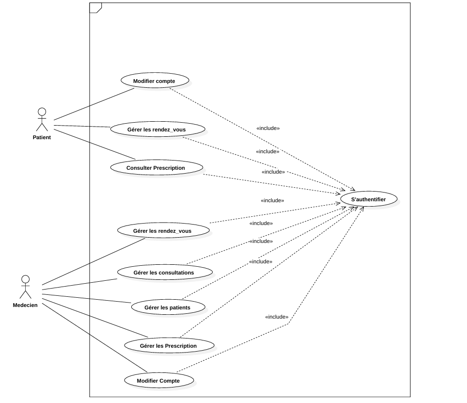
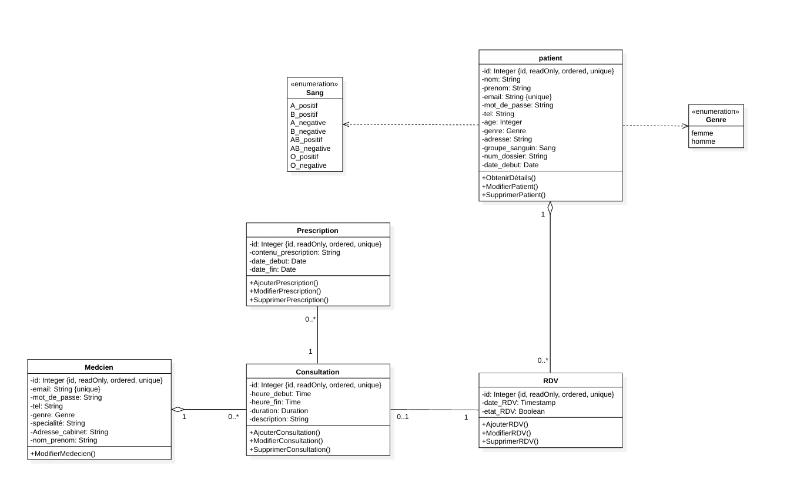

# Système de Gestion de Cabinet Médical

## Description

Ce projet est une application de gestion de cabinet médical développée en Node.js {Express}. Il permet aux médecins de gérer les rendez-vous, les dossiers des patients.

## Fonctionnalités du Backoffice (pour le médecin)

### Authentification
- Connexion sécurisée pour chaque médecin via email et mot de passe.

### Gestion des Rendez-vous
- **Consulter la liste des rendez-vous** : Affichage de tous les rendez-vous avec des options de filtre (par date, patient).
- **Supprimer un rendez-vous** : Possibilité de supprimer un rendez-vous en cas d'annulation.
- **Modifier un rendez-vous** : Option pour modifier la date, l’heure ou l’état d’un rendez-vous.
- **Consulter la liste des rendez-vous d’un patient** : Vue détaillée de tous les rendez-vous pour un patient spécifique.

### Gestion des Consultations
- Suivi des consultations effectuées, avec un accès aux dossiers médicaux correspondants.

### Gestion des Prescriptions
- Création de prescriptions médicales pour les patients.
- Mise à jour et gestion de l’historique des prescriptions.

### Gestion des Patients
1. **Consulter la Liste des Patients** :
   - Affichage de toutes les informations essentielles des patients, avec des options de tri et de filtre (nom, date d'inscription, groupe sanguin, genre, âge).
   - Accès rapide aux informations médicales de base et historique des consultations.
2. **Ajout de Nouveaux Patients** :
   - Possibilité d'enregistrer un nouveau patient dans le système.
3. **Modification des Informations Personnelles** :
   - Mise à jour des informations du patient en cas de changement.
   - Historique des modifications pour un suivi optimal.
4. **Suppression de Patients** :
   - Option de suppression d’un patient du système.
   - Gestion des autorisations pour éviter les suppressions accidentelles et sauvegarde d’un historique avant suppression pour référence.

## API Exposées pour les Patients

### Authentification
- **POST /api/auth** : Authentification des patients via leurs identifiants.

### Gestion des Patients
- **GET /api/patients/{id}** : Récupère les informations d'un patient spécifique via son identifiant.
- **PUT /api/patients/{id}** : Permet de modifier les informations du patient en utilisant son identifiant.

### Gestion des Rendez-vous
- **GET /api/rendez_vous?user={user_id}** : Récupère la liste des rendez-vous d'un patient spécifique.
- **POST /api/rendez-vous** : Permet au patient de prendre un nouveau rendez-vous.
- **PUT /api/rendez-vous/{id}** : Permet au patient de modifier un rendez-vous existant.
- **DELETE /api/rendez-vous/{id}** : Permet au patient de supprimer un rendez-vous.

### Gestion des Prescriptions
- **GET /api/prescriptions?user={id}** : Récupère la liste des prescriptions pour un patient spécifique.

## Diagrammes

### Diagramme de Cas d'Utilisation


### Diagramme de Classe


## Installation

### Prérequis
- Node.js
- Git

### Instructions
1. Clonez le dépôt :
   ```bash
   git clone https://github.com/dhouhabelakhel/MediCabinet.git
   cd MediCabinet
2. Installez les dépendances 
   npm install 
3. Installer Express
    npm install express 
4. Lancez le serveur 
   npm start
